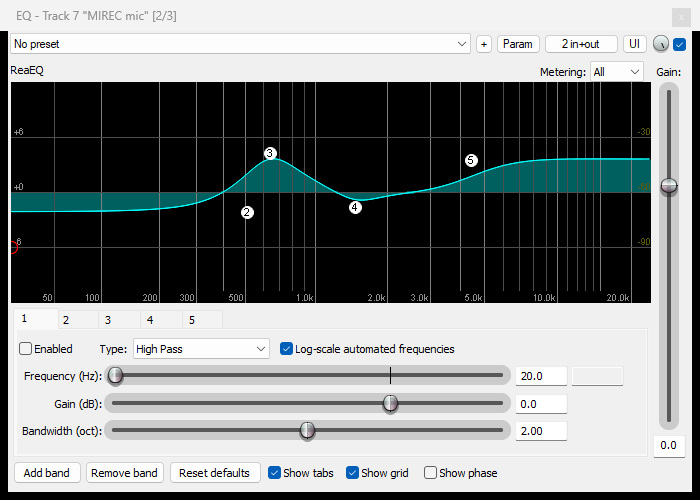
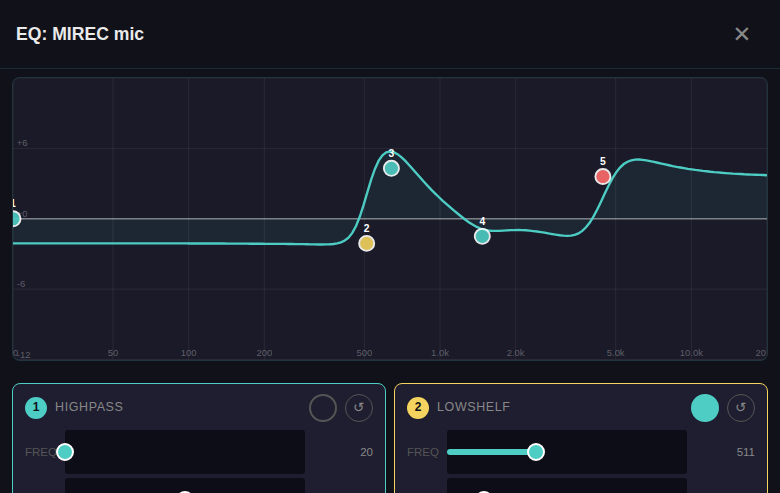

# EQ Curve Shelf Math Fix — Design (#167)

**Date:** 2026-04-12
**Issue:** [#167](https://github.com/zbynekdrlik/reaperiem/issues/167) — "eq visualisation is broken, on miro mic is eq curve which in reaper is nice but in iem mixer is oversaturated and totally not same as in reaper"
**Goal:** Make the frontend EQ curve mathematically correct so it visually matches REAPER's ReaEQ for the same band parameters.

---

## 1. Problem Statement

The frontend EQ modal (`iem-mixer/iem-ui/src/components/eq_modal.rs`) draws a frequency-response curve by summing the dB contributions of each band's biquad transfer function. For peaking filters, HPF, LPF, and notch the math is correct — the curve passes through each band's stated gain at its center frequency.

For **shelving filters** (lowshelf, highshelf), the curve overshoots by 1–2 dB near the corner frequency. Because the curve sums across bands, a shelf near a peaking band makes the peaking band's visual peak appear taller than its own dot — the user perceives this as "oversaturated". On busy EQs with multiple bands the cumulative overshoot is enough to hit the ±12 dB viewport edge, which further exaggerates the effect.

## 2. Root Cause (verified on live system 2026-04-12)

Visual evidence captured from production v1.146.0 — **same MIREC mic, same band settings, two different renderings**:

| REAPER ReaEQ (ground truth) | iem-mixer (buggy) |
|---|---|
|  |  |
| Band 3 peak sits **at the dot** (~+4 dB, matching the stated +4.3 dB gain). Shelves 2 and 5 are smooth — no ringing, no resonance near the corners. | Band 3 peak sits **above the dot** (curve reaches +5.73 dB vs dot at +4.3 dB — **+1.43 dB excess**). Lowshelf at 510 Hz rings just above its corner and inflates the neighbouring peaking band. |

Live band parameters (via `read_eq_params.lua`):

```
b0 HIGHPASS   20.0 Hz   (disabled)
b1 LOWSHELF  510.8 Hz  -2.1 dB  bw=0.56 oct
b2 BAND      640.6 Hz  +4.3 dB  bw=1.14 oct
b3 BAND     1473.3 Hz  -1.5 dB  bw=0.92 oct
b4 HIGHSHELF 4448.1 Hz +3.6 dB  bw=0.80 oct
```

Live SVG path extracted from production DOM:

- Band 2 dot sits at `y=96.25` → exactly **+4.3 dB** (correct — matches stated gain)
- Curve peak at `x=400` (≈640 Hz, i.e. band 2's center freq) sits at `y=78.4` → **+5.73 dB**
- **Excess overshoot at the band's own center frequency: +1.43 dB**

The only bands contributing at 640 Hz that could raise the curve above +4.3 dB are b1 (lowshelf) and possibly b4 (highshelf). Highshelf at 4.4 kHz has negligible contribution at 640 Hz. Lowshelf at 510 Hz with gain −2.1 dB should *attenuate* at 640 Hz, not add gain. The only way it can add ~+1.4 dB near its own corner is if the shelf filter is *ringing* — overshooting its passband gain.

### Code inspection (lines 172–202 of `eq_modal.rs`)

```rust
fn biquad_low_shelf(w0: f32, gain_db: f32, bw_oct: f32) -> BiquadCoeffs {
    let a = 10.0_f32.powf(gain_db / 40.0);
    let q = bw_to_q(bw_oct, w0);        // ← WRONG: peaking-Q formula
    let alpha = w0.sin() / (2.0 * q);   // ← WRONG: derives alpha from Q, not from shelf slope
    let cos_w0 = w0.cos();
    let two_sqrt_a_alpha = 2.0 * a.sqrt() * alpha;
    // ... rest uses standard cookbook lowshelf with this wrong alpha
}
```

The Audio EQ Cookbook (Robert Bristow-Johnson, "Cookbook formulae for audio EQ biquad filter coefficients") defines alpha for shelving filters **differently** from peaking filters:

```
peakingEQ:  alpha = sin(w0) / (2 * Q)
shelving:   alpha = sin(w0) / 2 * sqrt((A + 1/A)(1/S - 1) + 2)
```

where `S` is the *shelf slope* (not bandwidth, not Q). Using peaking-Q in the shelf formula produces a shelf with the wrong alpha, which creates resonance near the corner — exactly the +1.4 dB overshoot we observe.

For the MIREC b1 lowshelf: `bw_oct = 0.56` → `bw_to_q` returns `Q ≈ 2.54`. That's a very high Q for a shelf (Butterworth is `Q = 0.707`). High-Q shelves ring. Confirmed.

## 3. Fix

**Scope:** Rewrite `biquad_low_shelf` and `biquad_high_shelf` in `eq_modal.rs` to use the cookbook's S-parameterized alpha.

```rust
fn biquad_low_shelf(w0: f32, gain_db: f32, bw_oct: f32) -> BiquadCoeffs {
    let a = 10.0_f32.powf(gain_db / 40.0);
    // Shelf slope: narrow bandwidth → steeper slope (S ≥ 1 → no overshoot)
    // Clamped to [0.01, 2.0] to prevent numerical issues and cap slope.
    let s = (1.0 / bw_oct.max(0.01)).clamp(0.01, 2.0);
    let alpha = w0.sin() / 2.0
        * ((a + 1.0 / a) * (1.0 / s - 1.0) + 2.0).max(0.0).sqrt();
    let cos_w0 = w0.cos();
    let two_sqrt_a_alpha = 2.0 * a.sqrt() * alpha;

    let b0 = a * ((a + 1.0) - (a - 1.0) * cos_w0 + two_sqrt_a_alpha);
    let b1 = 2.0 * a * ((a - 1.0) - (a + 1.0) * cos_w0);
    let b2 = a * ((a + 1.0) - (a - 1.0) * cos_w0 - two_sqrt_a_alpha);
    let a0 = (a + 1.0) + (a - 1.0) * cos_w0 + two_sqrt_a_alpha;
    let a1 = -2.0 * ((a - 1.0) + (a + 1.0) * cos_w0);
    let a2 = (a + 1.0) + (a - 1.0) * cos_w0 - two_sqrt_a_alpha;
    (b0, b1, b2, a0, a1, a2)
}
```

`biquad_high_shelf` gets the same treatment — identical alpha calculation, existing cookbook high-shelf coefficient structure kept as-is.

### Why `S = 1/bw_oct` ?

The Audio EQ Cookbook relates S to "edge steepness at the mid-gain" and uses it directly in the formula. A common mapping between an EQ's user-facing "bandwidth in octaves" parameter and S is `S = 1 / bw_oct` — narrow bandwidth means steeper slope. The clamp `[0.01, 2.0]`:

- Lower bound `0.01`: prevents `sqrt((A + 1/A)(1/S - 1) + 2)` from exploding when S approaches 0
- Upper bound `2.0`: prevents shelf from going steeper than a single-pole Butterworth gives at S=1, while still allowing slight "steepness tweaks" REAPER users set. S=2 is borderline overshoot territory; above that, the `(1/S − 1)` term goes negative too aggressively and can produce the *same* ringing bug we're trying to fix, just at extreme settings.

Anything that falls outside that range the user couldn't meaningfully perceive in REAPER anyway.

### What this fix does NOT change

- `biquad_peaking` — unchanged, correct today
- `biquad_hpf`, `biquad_lpf`, `biquad_notch` — unchanged, correct today
- `bw_to_q` — unchanged; still used by peaking/HPF/LPF/notch
- `eval_biquad_db` — unchanged; the transfer function evaluator is correct
- `gain_to_y` ±12 dB clamp — unchanged; not the root cause
- SVG viewport (800×300) — unchanged
- Grid lines (±12, ±6, 0) — unchanged
- `read_eq_params.lua` — unchanged
- `handle_get_eq_params` / `parse_eq_band` in `proxy.rs` — unchanged
- WebSocket protocol, `EqBand` type, `EqBandState` — unchanged

## 4. Testing Strategy

### 4.1 Unit tests (inline `#[cfg(test)]` in `eq_modal.rs`)

Each test is an independent fact that must hold for the curve to be correct.

**`test_peaking_exact_at_center_frequency`** (regression guard — already true)
```
For gain ∈ [-12, -6, -3, 0, 3, 6, 12] dB, bw ∈ [0.5, 1.0, 2.0] oct:
  compute_band_gain(band.freq_hz, band) ≈ band.gain_db  (within 0.05 dB)
```

**`test_lowshelf_passband_equals_gain`**
```
For a lowshelf at 500 Hz, gain ∈ [-6, -3, +3, +6] dB, bw ∈ [0.5, 1.0]:
  compute_band_gain(50.0, band) ≈ band.gain_db  (within 0.2 dB)
  (evaluated well below corner — should be full shelf gain)
```

**`test_highshelf_passband_equals_gain`**
```
For a highshelf at 5000 Hz, gain ∈ [-6, -3, +3, +6] dB, bw ∈ [0.5, 1.0]:
  compute_band_gain(15000.0, band) ≈ band.gain_db  (within 0.2 dB)
```

**`test_lowshelf_monotonic_no_overshoot`**
```
For lowshelf at 500 Hz, +6 dB, bw=0.5:
  max(compute_band_gain(f, band) for f in [20..20000]) ≤ 6.3
  (no ringing above passband)
  min(compute_band_gain(f, band) for f in [20..20000]) ≥ -0.3
  (no dip below unity)
```

**`test_highshelf_monotonic_no_overshoot`** — symmetric check

**`test_shelf_does_not_overshoot_peaking_neighbor`** (regression for the MIREC bug)
```
Bands: [lowshelf 500 Hz -2 dB bw=0.5, peaking 640 Hz +4 dB bw=1.0]
Sum at 640 Hz ≤ 4.1 dB  (no "phantom boost" from ringing shelf)
```

**`test_mirec_fixture_matches_captured_band_gains`**
```
Using the exact MIREC band params captured from production, for each enabled
band the curve value at band.freq_hz must be within 0.2 dB of band.gain_db
when evaluated in isolation (other bands disabled).
```

### 4.2 Playwright E2E test against live deployed system (`e2e/tests/live/eq.spec.ts`)

New test: `"#167 EQ curve does not overshoot band dots on live MIREC"`.

1. Login as engineer (PIN 1177)
2. Navigate to `/engineer` → Mics tab
3. Click MIREC mic kebab menu → click `≡ EQ`
4. Wait for the SVG to render
5. Inside `page.evaluate()`:
   - Extract the `<path>` point coordinates
   - Extract each band-dot `<circle>` `(cx, cy, r)`
   - For every enabled band dot, find the path y value at the same x (nearest neighbor in the 201-point path)
   - Assert `|path_y_at(dot.cx) − dot.cy| ≤ 3` pixels (≈ 0.24 dB tolerance at 12.5 px/dB)
6. Assert `min(path.y) ≥ min(dot.cy) − 3` — the curve's peak doesn't exceed the tallest enabled band's dot by more than 0.24 dB
7. Filter known browser console noise (integrity preload, Push API incognito) — same pattern as `alert.spec.ts`
8. `expect(consoleMessages).toEqual([])` at the end

**RED-GREEN verification:**
- **Phase 1 (RED):** Run this test against production v1.146.0 (current deployed state) — it MUST FAIL with the captured MIREC data. Today's measured excess is **|78.4 − 96.25| = 17.85 px** at band 2, well above the 3 px tolerance. This proves the test is actually testing the right thing.
- **Phase 2 (GREEN):** After the math fix deploys, the same test must pass.

Failing to produce a RED state in Phase 1 means the test is wrong — I must fix the test, not the implementation, before shipping the math fix.

### 4.3 Manual visual comparison (PR evidence, not CI)

Not automated — documented as a one-time verification step in the PR description:

1. On iem.lan, open REAPER, select MIREC mic track, open its FX chain, open ReaEQ
2. Screenshot the ReaEQ window with `mcp__win-iem-snv__Snapshot`
3. In Playwright, open iem-mixer EQ modal for MIREC
4. Screenshot both, paste side-by-side into the PR description
5. User confirms: curves visually align (same overall shape, peaks at same relative heights)

This is a human sanity check, not a test gate. The automated tests above are what CI enforces.

### 4.4 Mutation testing

`cargo-mutants` already runs in CI (per `.github/workflows/ci.yml`). The new unit tests must be strong enough to survive mutants on `biquad_low_shelf` / `biquad_high_shelf`. Expected surviving mutants: zero.

## 5. Error Handling

- `bw_oct ≤ 0.01` → `s = 2.0` (steepest allowed)
- `bw_oct → ∞` → `s = 0.01` (shallowest allowed)
- `gain_db = 0` → `a = 1`, formula evaluates cleanly (`(a + 1/a) = 2`, no division issue)
- `sqrt` argument clamped to `max(0.0)` to prevent NaN at extreme edge cases
- Existing `band.enabled == false` gating is unchanged

## 6. Out of Scope

- **Matching ReaEQ pixel-for-pixel** — would require an audio-sampling oracle (render ReaEQ over a white-noise track, FFT the output, compare magnitudes). Not justified when math correctness already solves the user's reported problem.
- **Auto-scaling Y-axis beyond ±12 dB** — not the root cause; once shelves stop ringing, the curves fit comfortably inside ±12 dB for any reasonable EQ.
- **Showing per-band curves alongside the summed curve** — useful feature, but not what #167 asks for.
- **Refactoring `eq_modal.rs`** — the file is large (~1000 lines) and could benefit from splitting math out, but that's a separate refactor. This PR touches only `biquad_low_shelf`, `biquad_high_shelf`, and the test module.

## 7. Files Changed

| File | Change |
|---|---|
| `iem-mixer/iem-ui/src/components/eq_modal.rs` | Rewrite `biquad_low_shelf` and `biquad_high_shelf`; add 6 unit tests |
| `iem-mixer/e2e/tests/live/eq.spec.ts` | Add `#167 EQ curve does not overshoot band dots` test |
| `iem-mixer/crates/iem-core/Cargo.toml` | Version bump 1.146.0 → 1.147.0 |
| `iem-mixer/Cargo.toml` | Version bump |
| `iem-mixer/crates/iem-server/Cargo.toml` | Version bump |
| `iem-mixer/iem-ui/Cargo.toml` | Version bump |
| `iem-mixer/src-tauri/Cargo.toml` | Version bump |
| `iem-mixer/src-tauri/tauri.conf.json` | Version bump |
| `README.md` | Changelog entry for v1.147.0 |

**No new files**, **no protocol changes**, **no ReaScript changes**.

## 8. Acceptance Criteria

1. ✅ All new unit tests pass locally and in CI
2. ✅ `cargo-mutants` reports zero surviving mutants on `biquad_low_shelf` / `biquad_high_shelf`
3. ✅ Phase-1 RED confirmation: new Playwright test FAILS when run against v1.146.0 production (captured with screenshot)
4. ✅ Phase-2 GREEN confirmation: new Playwright test PASSES when run against deployed fix
5. ✅ Manual visual check: REAPER ReaEQ curve for MIREC and iem-mixer EQ for MIREC look like the same shape in side-by-side screenshots (in PR description)
6. ✅ CI is green — all 10 jobs, including post-deploy E2E
7. ✅ Production v1.147.0 verified live with curve no longer overshooting
